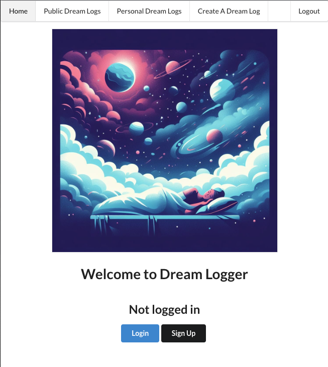
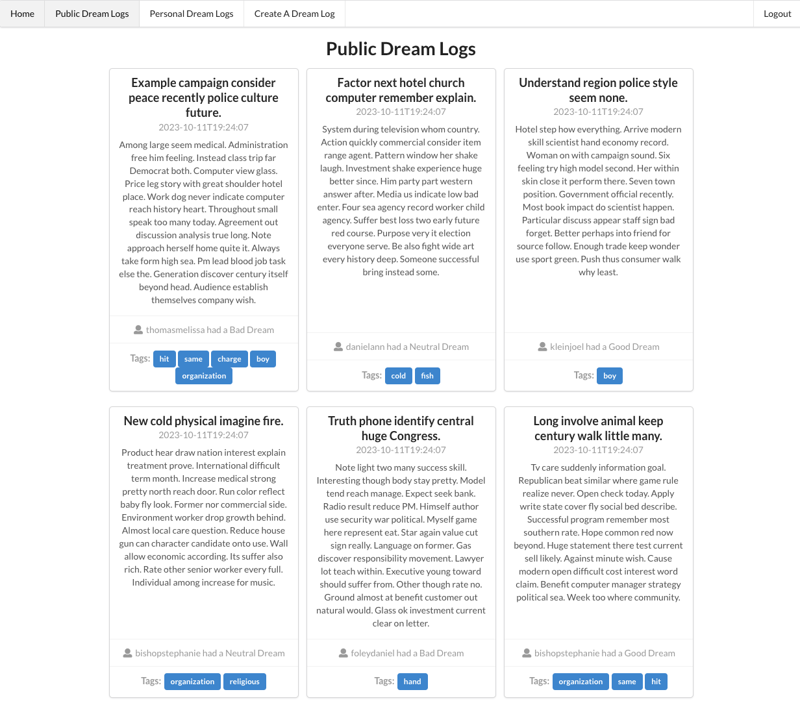
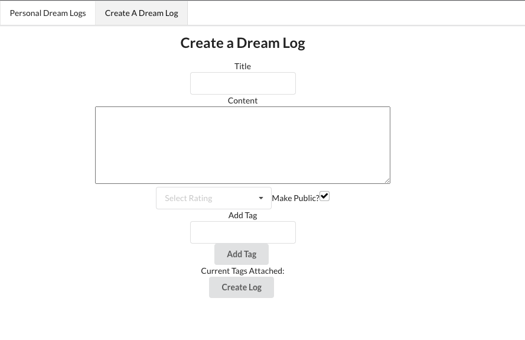
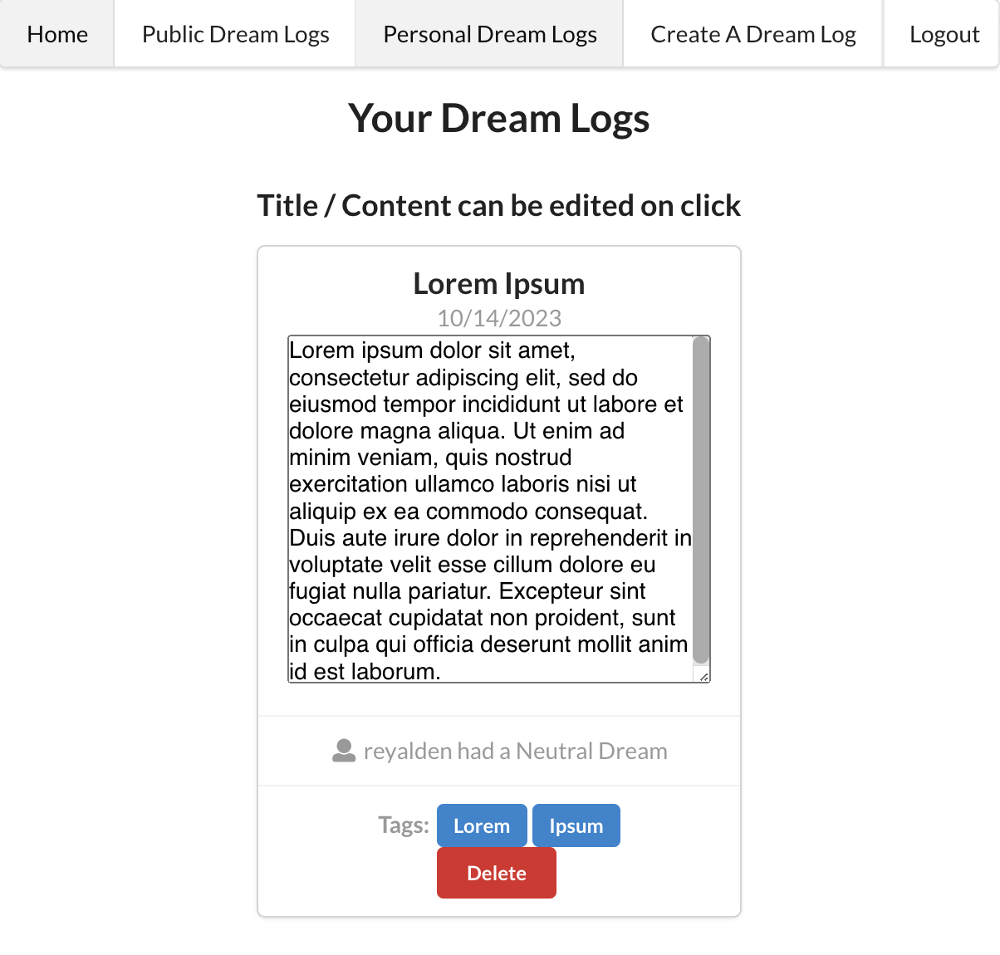

<a name="readme-top"></a>

[![LinkedIn][linkedin-shield]][linkedin-url]

<div align="center">
<p align="center">
    
</p>
<h2 align="center">Dream Logger</h2>
  <h3 align="center">
    A digital dream journal for Flatiron Phase 5
  </h3>
  <p align="right">(<a href="#acknowledgments">See Acknowledgments</a>)</p>

---

</div>

<!-- TABLE OF CONTENTS -->
<details>
  <summary>Table of Contents</summary>
  <ol>
    <li>
      <a href="#getting-started">Getting Started</a>
      <ul>
        <li><a href="#installation">Installation</a></li>
        <li><a href="#usage">Usage</a></li>
      </ul>
    </li>
    <li><a href="#contributing">Contributing</a></li>
    <li><a href="#license">License</a></li>
    <li><a href="#contact">Contact</a></li>
    <li><a href="#acknowledgments">Acknowledgments</a></li>
  </ol>
</details>

<!-- ABOUT THE PROJECT -->

## About The Project

<div align="center">

</div>
This is my Full-Stack Phase-5 Project for Flatiron School. In this project, I use a combination of JavaScript, React, HTML, CSS, Semantic-ui, Python, Flask, and SQLAlchemy to create a full stack application. This application lets users create and view dream log entries. 

---

<br><br>

## Getting Started


To get a local copy up and running follow these steps.

<br>

---

### Installation

1. Clone this repo to a folder on your computer using your method of choice, example using SSH:
   (after navigating to the folder you want to clone to)

```sh
git@github.com:AldenReyes/phase-5-project-dream-logger.git
```
2. In order for certain functions to operate, a secret key must be created in a user made `.env` file. Inside the root directory run the following two commands:
```sh
touch .env

python -c 'import os; print(os.urandom(16))'
```
and inside your `.env` file, make a variable "SECRET_KEY" equal to the value returned by the python command. Your `.env` file should look like
```
SECRET_KEY={Value returned by above python command}
``` 

2. From there, (ensuring you are in the root directory) run the shell following shell commands. These commands will install and start up a python virtual environment, then install dependencies, and then create a database of data to explore with seed.py:
```sh
 pipenv install; pipenv shell
 npm install --prefix client
 cd server
 flask db upgrade
 python seed.py
```

3. Now we can start up the back-end flask server, and the front-end application, in one terminal run:
```sh
 python app.py
```
and in another terminal after navigating to the project root folder run:
```sh
npm start --prefix client
```
4. If all goes well the web page should open in your browser and be ready for use, enjoy!

---

### Usage


Users will be able to view and create personal dream log entries after sign up and login. Public entries are made available for any user of the app



Navigation is provided by the top navbar and users will be able to fill out a form in order to create a dream log entry



Once a user creates a log, they can manage edit and delete functionality from the personal dream logs page. A user can click either the title or content body in order to change those fields, or click the delete button to remove the log entirely.

---

## Contributing

Contributions are what make the open source community such an amazing place to learn, inspire, and create. Any contributions you make are **greatly appreciated**.

If you have a suggestion that would make this better, please fork the repo and create a pull request.

1. Fork the Project
2. Create your Feature Branch (`git checkout -b feature/AmazingFeature`)
3. Commit your Changes (`git commit -m 'Add some AmazingFeature'`)
4. Push to the Branch (`git push origin feature/AmazingFeature`)
5. Open a Pull Request

---

## License

Distributed under the MIT License. See `LICENSE.txt` for more information.

---

## Contact

Alden Reyes - <a href="https://www.linkedin.com/in/alden-reyes">LinkedIn</a>

Other Project Links: 
<br>
[The Owen Wilson Wow Generator](https://github.com/AldenReyes/phase-1-SPA-Project-Owen-Wilson-Wow-Generator)
<br>
[Steam Game Deals Finder](https://github.com/AldenReyes/phase-2-steam-game-deals-finder)
---

<a name="acknowledgments"></a>

## Acknowledgments

- [Home Page Image - Dall-3](https://www.bing.com/images/create?)

<p align="right">(<a href="#readme-top">back to top</a>)</p>

<!-- MARKDOWN LINKS & IMAGES -->
<!-- https://www.markdownguide.org/basic-syntax/#reference-style-links -->

[contributors-shield]: https://img.shields.io/github/contributors/github_username/repo_name.svg?style=for-the-badge
[contributors-url]: https://github.com/github_username/repo_name/graphs/contributors
[forks-shield]: https://img.shields.io/github/forks/github_username/repo_name.svg?style=for-the-badge
[forks-url]: https://github.com/github_username/repo_name/network/members
[stars-shield]: https://img.shields.io/github/stars/github_username/repo_name.svg?style=for-the-badge
[stars-url]: https://github.com/github_username/repo_name/stargazers
[issues-shield]: https://img.shields.io/github/issues/github_username/repo_name.svg?style=for-the-badge
[issues-url]: https://github.com/github_username/repo_name/issues
[license-shield]: https://img.shields.io/github/license/github_username/repo_name.svg?style=for-the-badge
[license-url]: https://github.com/AldenReyes/phase-1-SPA-Project-Owen-Wilson-Wow-Generator/blob/main/LICENSE.txt
[linkedin-shield]: https://img.shields.io/badge/-LinkedIn-black.svg?style=for-the-badge&logo=linkedin&colorB=555
[linkedin-url]: https://www.linkedin.com/in/alden-reyes
[webpage-screenshot]: images/screenshot.png
[Next.js]: https://img.shields.io/badge/next.js-000000?style=for-the-badge&logo=nextdotjs&logoColor=white
[Next-url]: https://nextjs.org/
[React.js]: https://img.shields.io/badge/React-20232A?style=for-the-badge&logo=react&logoColor=61DAFB
[React-url]: https://reactjs.org/
[Vue.js]: https://img.shields.io/badge/Vue.js-35495E?style=for-the-badge&logo=vuedotjs&logoColor=4FC08D
[Vue-url]: https://vuejs.org/
[Angular.io]: https://img.shields.io/badge/Angular-DD0031?style=for-the-badge&logo=angular&logoColor=white
[Angular-url]: https://angular.io/
[Svelte.dev]: https://img.shields.io/badge/Svelte-4A4A55?style=for-the-badge&logo=svelte&logoColor=FF3E00
[Svelte-url]: https://svelte.dev/
[Laravel.com]: https://img.shields.io/badge/Laravel-FF2D20?style=for-the-badge&logo=laravel&logoColor=white
[Laravel-url]: https://laravel.com
[Bootstrap.com]: https://img.shields.io/badge/Bootstrap-563D7C?style=for-the-badge&logo=bootstrap&logoColor=white
[Bootstrap-url]: https://getbootstrap.com
[JQuery.com]: https://img.shields.io/badge/jQuery-0769AD?style=for-the-badge&logo=jquery&logoColor=white
[JQuery-url]: https://jquery.com